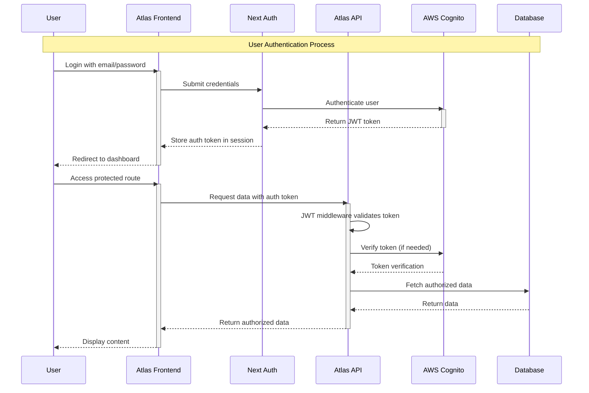
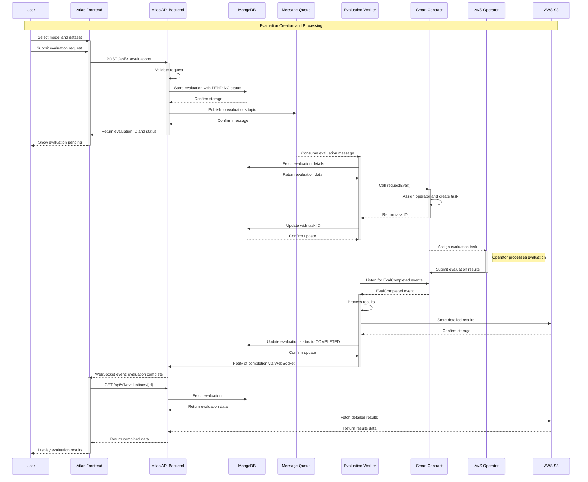
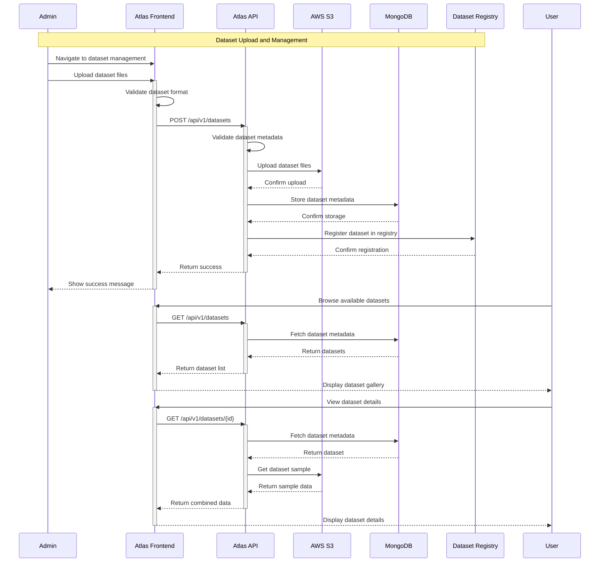
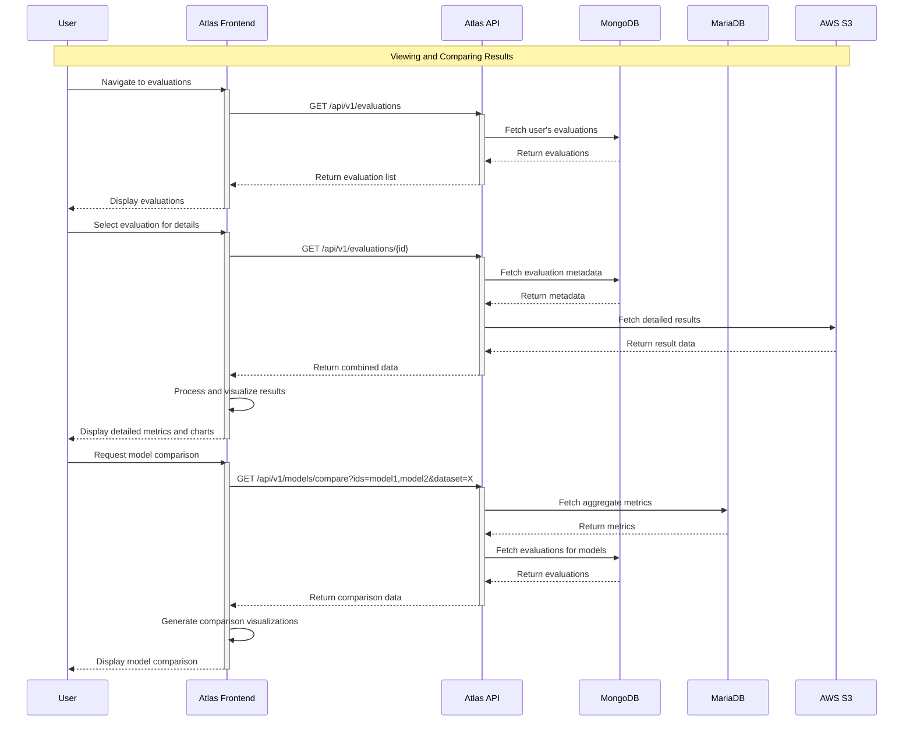
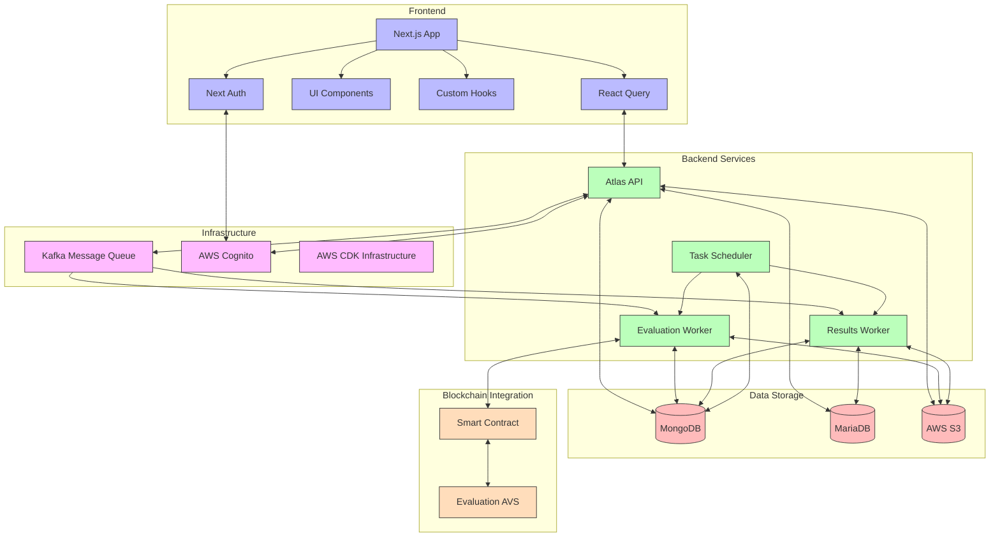

# Atlas App Sequence Diagrams

## 1. User Authentication Flow

## 2. Evaluation Creation and Processing Flow

## 3. Dataset Management Flow

## 4. Results Viewing and Comparison Flow

## 5. Complete System Architecture

