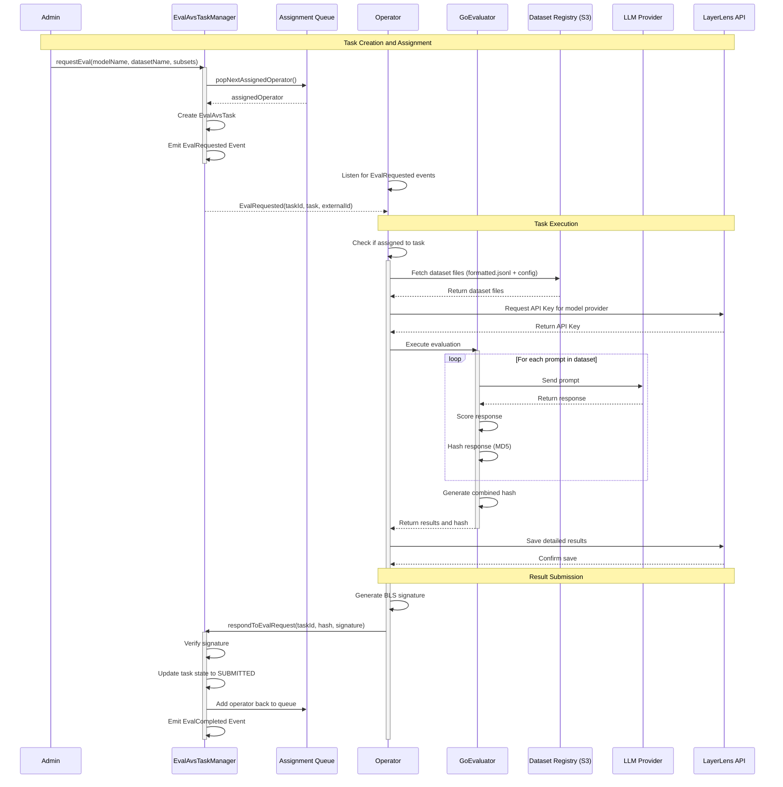
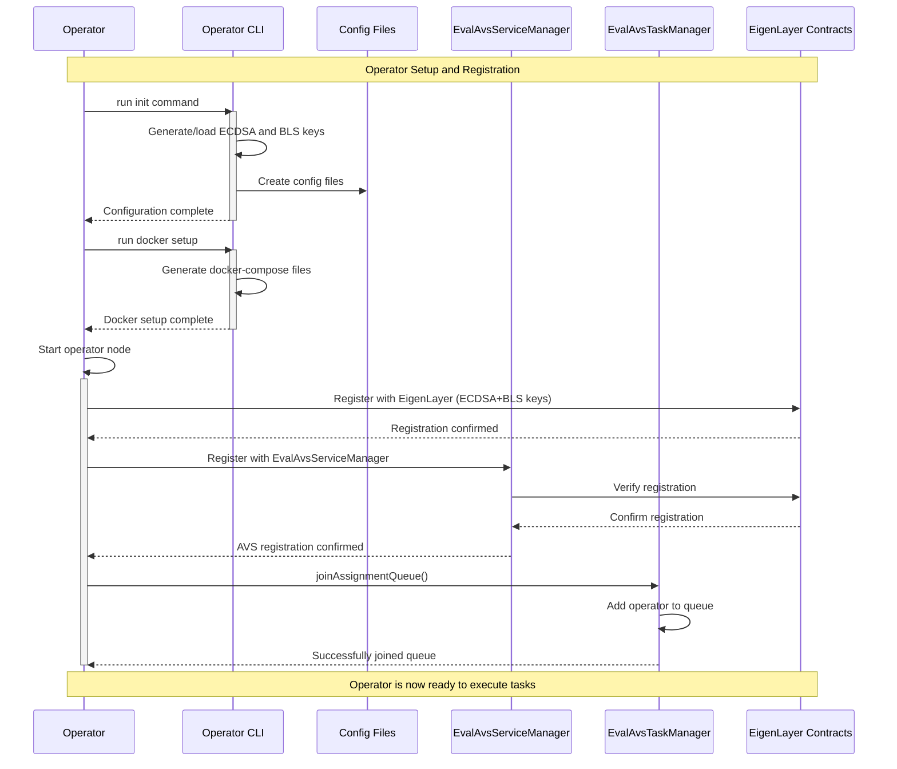
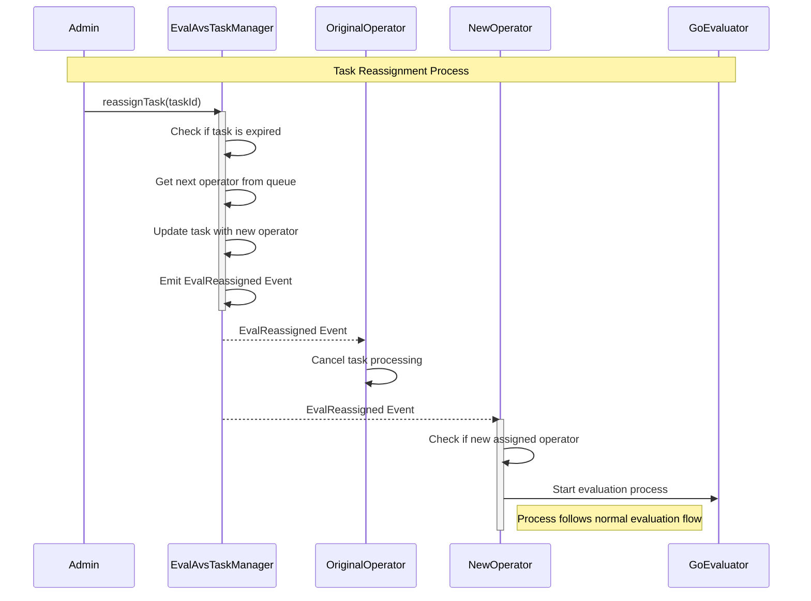

# Evaluation AVS Sequence Diagrams

## 1. Task Creation and Assignment Flow



## 2. Operator Registration Flow



## 3. Task Reassignment Flow



## 4. Complete System Architecture

<div style="background-color:white; padding:20px;">

```mermaid
%%{init: {'theme': 'base', 'themeVariables': {'primaryColor': '#ffadce', 'primaryTextColor': '#000000', 'primaryBorderColor': '#000000', 'lineColor': '#000000', 'secondaryColor': '#adc8ff', 'tertiaryColor': '#c4ffad', 'background': '#ffffff', 'mainBkg': '#ffffff', 'taskTextColor': '#000000', 'taskTextOutsideColor': '#000000', 'canvasBkg': '#ffffff'}, 'fontFamily': 'Arial', 'fontSize': 16, 'fontWeight': 900}}%%
flowchart TB
    %% Force white background
    graph[bgcolor="#ffffff"]
    %% Setting white backgrounds for all sections
    subgraph Blockchain["BLOCKCHAIN"]
        TaskManager["TASK MANAGER CONTRACT"]
        ServiceManager["SERVICE MANAGER CONTRACT"]
        EigenLayer["EIGENLAYER CONTRACTS"]
    end
    
    subgraph OperatorNode["OPERATOR NODE"]
        OpMain["OPERATOR MAIN"]
        AvsReader["AVS READER"]
        AvsWriter["AVS WRITER"]
        AvsSubscriber["AVS SUBSCRIBER"]
        Registration["REGISTRATION"]
    end
    
    subgraph EvalEngine["EVALUATION ENGINE"]
        GoEval["GO-EVALUATOR"]
        Extractor["RESPONSE EXTRACTOR"]
        Scoring["SCORING MODULE"]
        PythonExec["PYTHON EXECUTOR"]
    end
    
    subgraph ExternalServices["EXTERNAL SERVICES"]
        S3[("DATASET REGISTRY (S3)")]
        LLMAPI["LLM PROVIDER API"]
        Results["LAYERLENS RESULTS API"]
    end
    
    %% Connections with thicker lines
    TaskManager <--> ServiceManager
    ServiceManager <--> EigenLayer
    
    OpMain --> Registration
    Registration --> ServiceManager
    OpMain --> AvsSubscriber
    AvsSubscriber --> TaskManager
    OpMain --> AvsReader
    AvsReader --> TaskManager
    OpMain --> AvsWriter
    AvsWriter --> TaskManager
    
    OpMain --> GoEval
    GoEval --> Extractor
    GoEval --> Scoring
    GoEval --> PythonExec
    
    GoEval --> S3
    GoEval --> LLMAPI
    GoEval --> Results
    
    %% Classification styling with darker colors and thicker borders
    classDef blockchain fill:#ffadce,stroke:#000000,stroke-width:4px,color:#000000,font-weight:900,text-transform:uppercase
    classDef operator fill:#adc8ff,stroke:#000000,stroke-width:4px,color:#000000,font-weight:900,text-transform:uppercase
    classDef evaluator fill:#c4ffad,stroke:#000000,stroke-width:4px,color:#000000,font-weight:900,text-transform:uppercase
    classDef external fill:#ffbbad,stroke:#000000,stroke-width:4px,color:#000000,font-weight:900,text-transform:uppercase
    classDef section fill:#ffffff,stroke:#000000,color:#000000
    
    class TaskManager,ServiceManager,EigenLayer blockchain
    class OpMain,AvsReader,AvsWriter,AvsSubscriber,Registration operator
    class GoEval,Extractor,Scoring,PythonExec evaluator
    class S3,LLMAPI,Results external
    class Blockchain,OperatorNode,EvalEngine,ExternalServices section
```

</div>