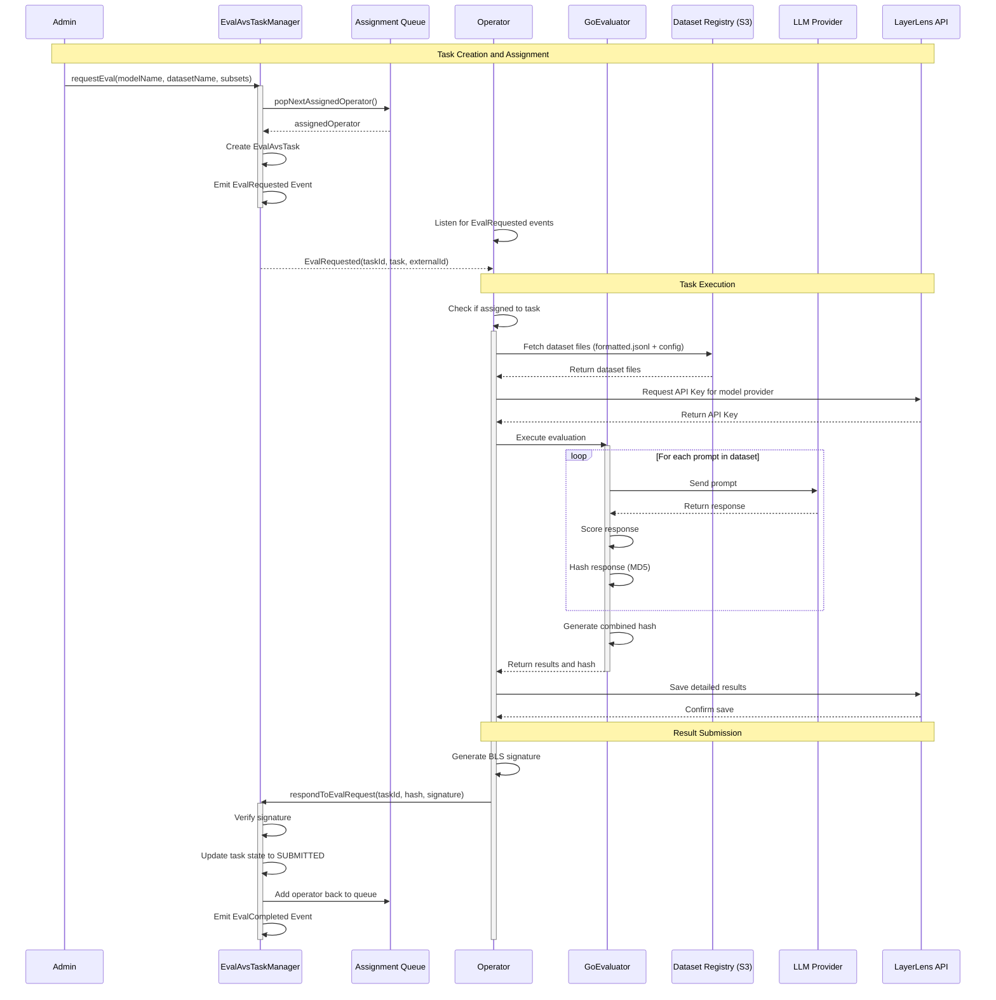
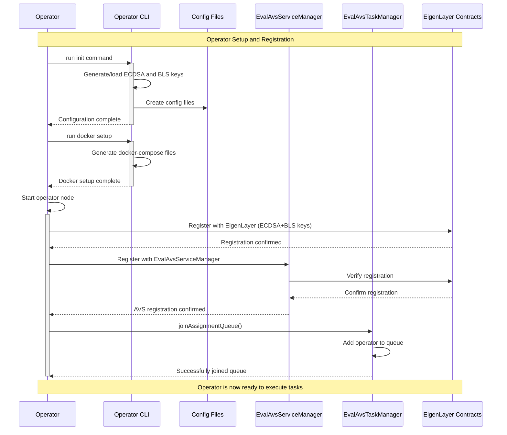
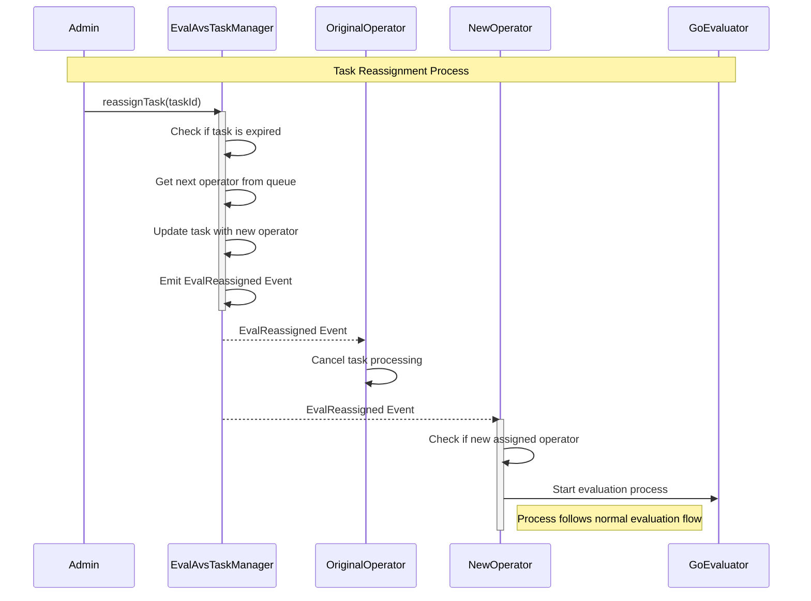
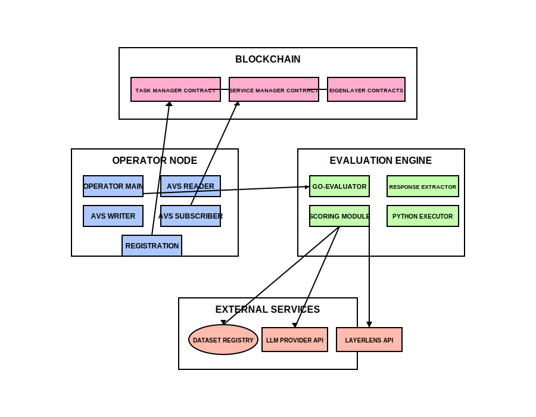

# Evaluation AVS Sequence Diagrams

## 1. Task Creation and Assignment Flow

```mermaid
sequenceDiagram
    participant Admin
    participant TaskManager as EvalAvsTaskManager
    participant Queue as Assignment Queue
    participant Operator
    participant GoEvaluator
    participant S3 as Dataset Registry (S3)
    participant LLM as LLM Provider
    participant API as LayerLens API

    Note over Admin,API: Task Creation and Assignment
    
    Admin->>TaskManager: requestEval(modelName, datasetName, subsets)
    activate TaskManager
    TaskManager->>Queue: popNextAssignedOperator()
    Queue-->>TaskManager: assignedOperator
    TaskManager->>TaskManager: Create EvalAvsTask
    TaskManager->>TaskManager: Emit EvalRequested Event
    deactivate TaskManager
    
    Operator->>Operator: Listen for EvalRequested events
    TaskManager-->>Operator: EvalRequested(taskId, task, externalId)
    
    Note over Operator,API: Task Execution
    
    Operator->>Operator: Check if assigned to task
    activate Operator
    Operator->>S3: Fetch dataset files (formatted.jsonl + config)
    S3-->>Operator: Return dataset files
    Operator->>API: Request API Key for model provider
    API-->>Operator: Return API Key
    Operator->>GoEvaluator: Execute evaluation
    
    activate GoEvaluator
    loop For each prompt in dataset
        GoEvaluator->>LLM: Send prompt
        LLM-->>GoEvaluator: Return response
        GoEvaluator->>GoEvaluator: Score response
        GoEvaluator->>GoEvaluator: Hash response (MD5)
    end
    GoEvaluator->>GoEvaluator: Generate combined hash
    GoEvaluator-->>Operator: Return results and hash
    deactivate GoEvaluator
    
    Operator->>API: Save detailed results
    API-->>Operator: Confirm save
    
    Note over Operator,API: Result Submission
    
    Operator->>Operator: Generate BLS signature
    Operator->>TaskManager: respondToEvalRequest(taskId, hash, signature)
    activate TaskManager
    TaskManager->>TaskManager: Verify signature
    TaskManager->>TaskManager: Update task state to SUBMITTED
    TaskManager->>Queue: Add operator back to queue
    TaskManager->>TaskManager: Emit EvalCompleted Event
    deactivate TaskManager
    deactivate Operator
```

## 2. Operator Registration Flow

```mermaid
sequenceDiagram
    participant Operator
    participant CLI as Operator CLI
    participant Config as Config Files
    participant ServiceManager as EvalAvsServiceManager
    participant TaskManager as EvalAvsTaskManager
    participant EigenLayer as EigenLayer Contracts
    
    Note over Operator,EigenLayer: Operator Setup and Registration
    
    Operator->>CLI: run init command
    activate CLI
    CLI->>CLI: Generate/load ECDSA and BLS keys
    CLI->>Config: Create config files
    CLI-->>Operator: Configuration complete
    deactivate CLI
    
    Operator->>CLI: run docker setup
    activate CLI
    CLI->>CLI: Generate docker-compose files
    CLI-->>Operator: Docker setup complete
    deactivate CLI
    
    Operator->>Operator: Start operator node
    activate Operator
    Operator->>EigenLayer: Register with EigenLayer (ECDSA+BLS keys)
    EigenLayer-->>Operator: Registration confirmed
    
    Operator->>ServiceManager: Register with EvalAvsServiceManager
    ServiceManager->>EigenLayer: Verify registration
    EigenLayer-->>ServiceManager: Confirm registration
    ServiceManager-->>Operator: AVS registration confirmed
    
    Operator->>TaskManager: joinAssignmentQueue()
    TaskManager->>TaskManager: Add operator to queue
    TaskManager-->>Operator: Successfully joined queue
    deactivate Operator
    
    Note over Operator,EigenLayer: Operator is now ready to execute tasks
```

## 3. Task Reassignment Flow

```mermaid
sequenceDiagram
    participant Admin
    participant TaskManager as EvalAvsTaskManager
    participant OriginalOperator
    participant NewOperator
    participant GoEvaluator
    
    Note over Admin,GoEvaluator: Task Reassignment Process
    
    Admin->>TaskManager: reassignTask(taskId)
    activate TaskManager
    TaskManager->>TaskManager: Check if task is expired
    TaskManager->>TaskManager: Get next operator from queue
    TaskManager->>TaskManager: Update task with new operator
    TaskManager->>TaskManager: Emit EvalReassigned Event
    deactivate TaskManager
    
    TaskManager-->>OriginalOperator: EvalReassigned Event
    OriginalOperator->>OriginalOperator: Cancel task processing
    
    TaskManager-->>NewOperator: EvalReassigned Event
    activate NewOperator
    NewOperator->>NewOperator: Check if new assigned operator
    NewOperator->>GoEvaluator: Start evaluation process
    Note right of NewOperator: Process follows normal evaluation flow
    deactivate NewOperator
```

## 4. Complete System Architecture

